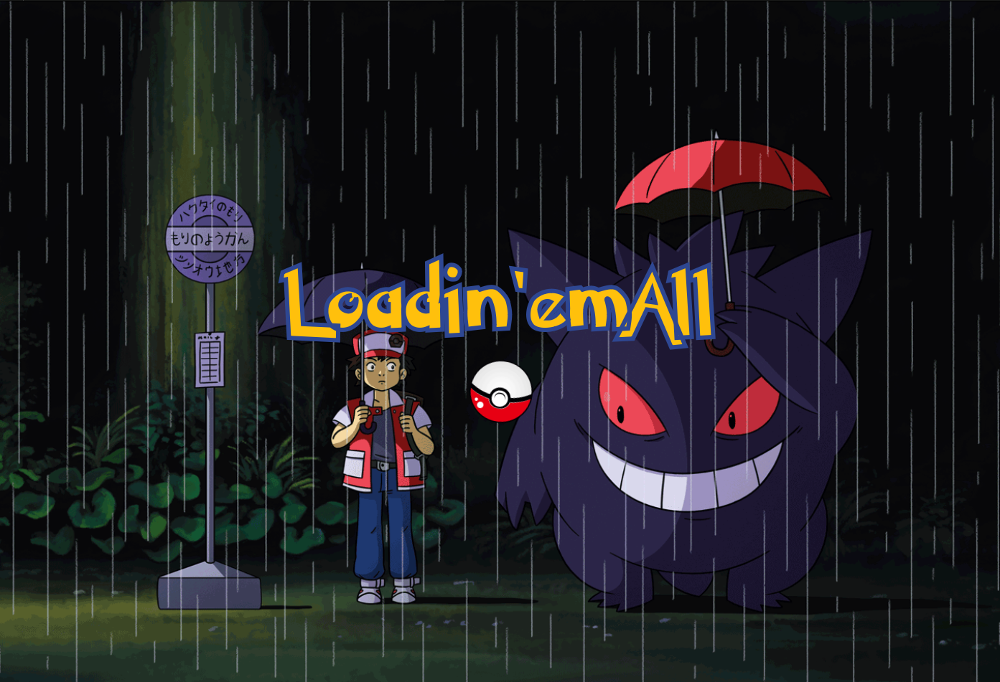
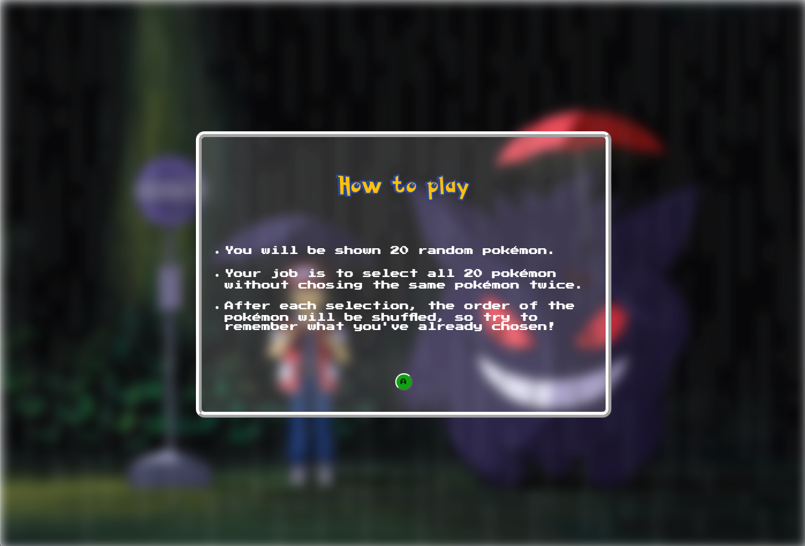
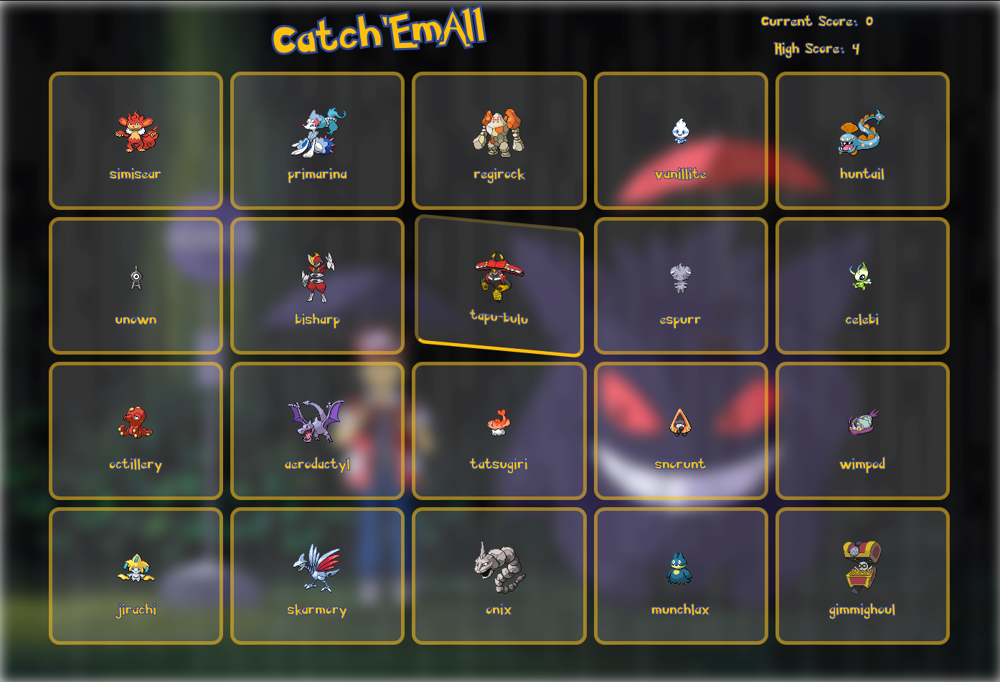
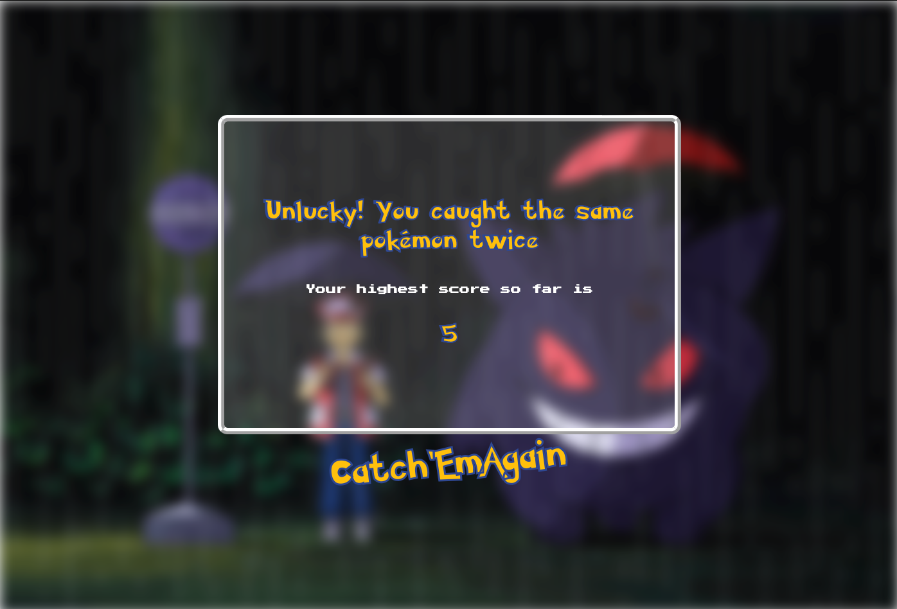

# Catch-em-all

---

## About this project

This project is an assignment as part of The Odin Project. The purpose of this project is to build a single-page memory game where users try to select all the images without clicking the same image twice. However, the set of images is shuffled between each click. This project was assigned to showcase a broad knowledge and understanding of the React environment and advanced JavaScript and CSS skills.

---

## Technologies used

-React
 
-JS
 
-Css

---

## Screenshots

### Picture 1

### Picture 2

### Picture 3

### Picture 4

